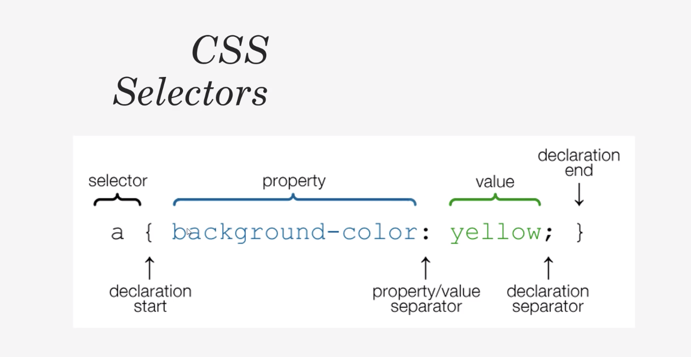

# Pure-CSS

<h2>What is CSS</h2>
<ul>
<li>Cascading Stylesheets</li>
<li>Not a programming language</li>
<li>Stylesheet/Styling language</li>
<li>Used for website layout and design</li>
<li>Can be extended with Sass/Less</li>
</ul>

<hr>

<h2>3 Methods for adding CSS</h2>
<ul>
<li><strong>Inline CSS:</strong>Directly in the html(please do not use this!!!)</li>
<li><strong>Internal CSS:</strong>Using style tags within a single document</li>
<li><strong>External CSS:</strong>Linking an external .css</li>
</ul>

<hr>

<h2>CSS Selectors</h2>


<h2>Colors In CSS</h2>
-Color Names
<code><pre>
body {
    color:red;
    background:coral;
}
</pre></code>

-HTML5 Color Names
```
h1 {
    color: #f4f4f4;
}
```

-RGB
```
p {
    color: rgb(0,0,255);
}
```

<hr>

<h2>Positioning in CSS</h2>
<ul>
  <li>Static</li>
  <li>Relative</li>
  <li>Absolute</li>
  <li>Fixed</li>
  <li>Initial</li>
  <li>Inherit</li>
</ul>

<hr>

<h2>What is FlexBox</h2>
: A CSS3 layout mode that provides an easy and clean way to arrange items within a container
<ul>
  <li>No float</li>
  <li>responsive and mobile friendly</li>
  <li>Positioning child elements is Much easier </li>
  <li>Flex container's margins do not collapse with the margins if its contents</li>
  <li>Order of elements can easily be changed without editing the source HTML</li>
</ul>

<hr>

<h2>Flexible box model concept</h2>
<ul>
  <li>The ability to alter item width and height to best width and height to best fit in its containers available free space</li>
  <li>Flexbox is direction-agnostic</li>
  <li>Built for small-scale layout while the upcoming "Grid" specification is for more large scale</li>
</ul>
